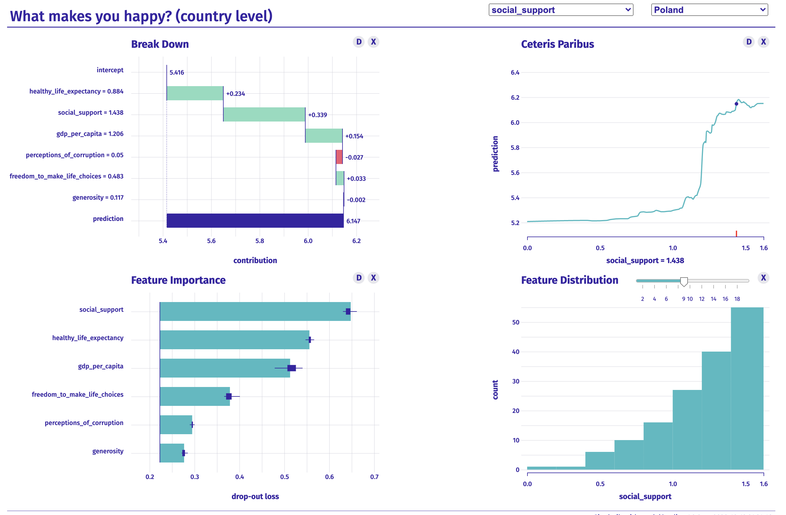

# xai-happiness

XAI use case based on world-happiness data.

Find a live demo: https://pbiecek.github.io/xai-happiness/



## What factors correlate with happiness at national level?

1. Get data about happiness from 
https://www.kaggle.com/unsdsn/world-happiness

2. Train your favorite ML model that will predict the happiness score

3. Explain the model with [modelStudio](https://github.com/ModelOriented/modelStudio)

```r
library("DALEX")
library("modelStudio")
library("ranger")

# get data
happiness <- readRDS("happiness.rds")

# get model and explainer
model <- ranger(score~., data = happiness)
modelr <- explain(model, data = happiness[,-1], y = happiness$score)

# get model studio
ms <- modelStudio(modelr, happiness[c("Poland","Finland","Germany"),],
                  options = ms_options(margin_left = 220))
ms
```

